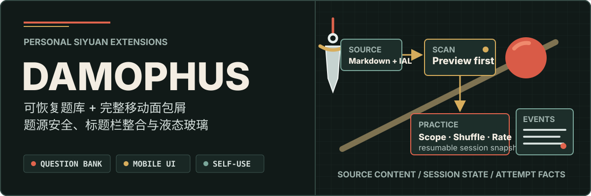
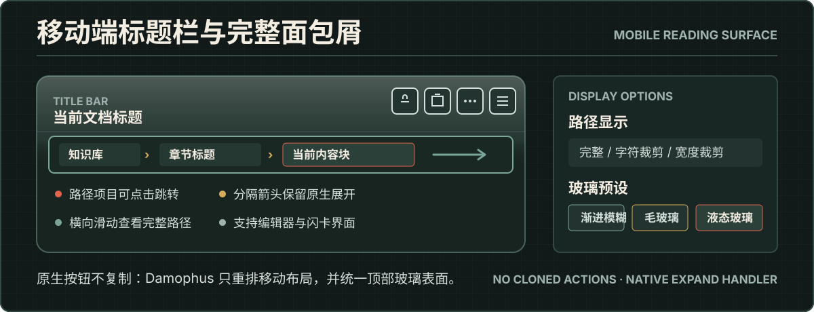
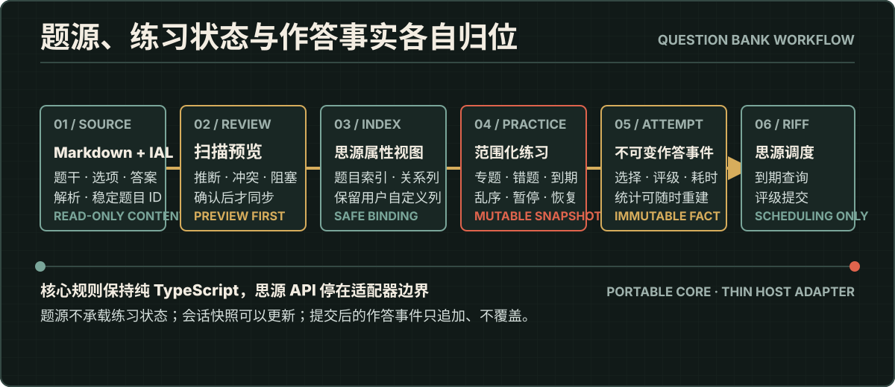
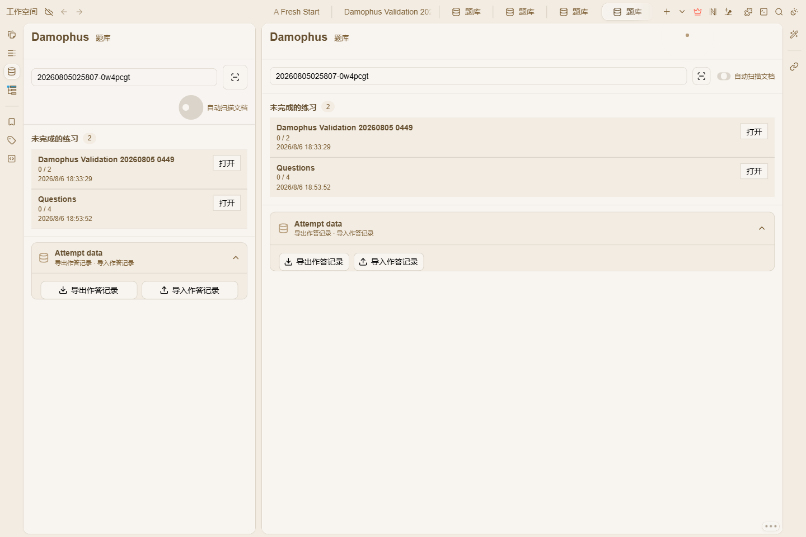
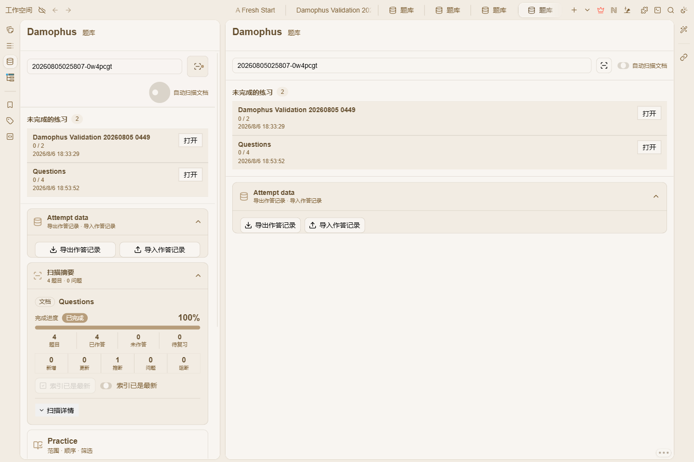
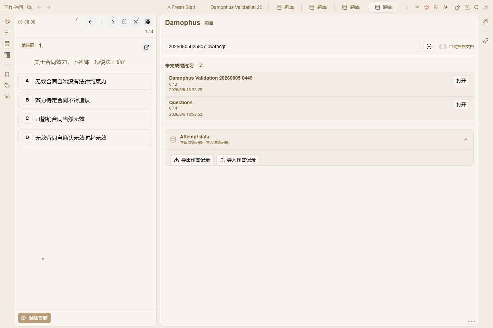
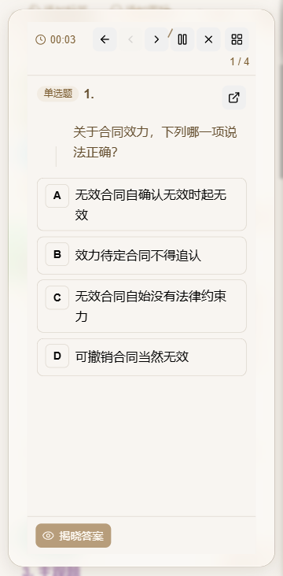

<p align="center">
  
</p>

Damophus 是一个自用的思源增强插件，集中实现现有工具没有同时覆盖、或难以直接组合的个人工作流。目前主要包含两部分：让 Markdown 题源进入扫描、索引、练习与恢复流程，以及改善移动端标题栏、面包屑和顶部玻璃表面的可用性。

[](https://github.com/HibernalGlow/siyuan-damophus)
[](https://github.com/HibernalGlow/siyuan-damophus/commits/main)
[](./LICENSE)


[](https://svelte.dev/)
[](https://www.typescriptlang.org/)
[](https://vite.dev/)
[](https://vitest.dev/)

<p align="center">
  <a href="#功能一览">功能一览</a> ·
  <a href="#它解决什么">定位</a> ·
  <a href="#移动端增强">移动端</a> ·
  <a href="#工作流程">流程</a> ·
  <a href="#分模块介绍">模块</a> ·
  <a href="#快速开始">快速开始</a> ·
  <a href="#数据边界">数据边界</a> ·
  <a href="#文档地图">文档</a>
</p>

## 功能一览

按模块分组的完整功能清单。🆕 标记 0.1.0 新增能力，其余为既有能力。日常使用频率高的小功能在前，重型题库见文末。

### 动图重播（lets-animated-image-replay）🆕

- GIF、WebP、APNG 动图默认停在首帧，右下角按钮或桌面端悬停重新播放
- 悬停延迟、重播缓存数量、大图预览重播行为可调

### 列表合并（lets-list-merge）🆕

- 合并选中的多个有序/无序列表，保留原内容、样式、块属性与嵌套结构
- 混合类型可统一为有序/无序；有序编号自动重排；单步撤销/重做；三种合并命令可绑定快捷键

### Kramdown 导出（lets-kramdown-export）🆕

- 将选中的多个块或整篇文档复制为带 IAL 的 Markdown（顶栏菜单 / 块图标 / 文档标题菜单入口）
- IAL 三档模式（portable / all / none）与包含/排除通配规则；保留表格及合并信息
- 与 Agent Bridge CLI 共用同一导出器，可命令行导出

### 移动端完整面包屑（lets-mobile-breadcrumb）🆕

- 编辑器和闪卡的完整块路径，每级可点击跳转，箭头保留思源原生展开
- 路径过长时可触摸横向滚动；可选优先显示文档根部或当前位置
- 路径文字完整显示，或按字符数/显示宽度裁剪，完整原文保留在提示信息中

### 移动端一体式液态玻璃（lets-mobile-liquid-glass）

- 标题栏与面包屑统一为半透明折射层，向正文自然渐隐
- 渐进模糊、毛玻璃、液态玻璃三种预设，不依赖特定主题或插件

### 题库块标识（lets-block-attr）

- 在指定块类型下显示安全的题库身份属性（题目 ID、题型），答案属性始终隐藏
- 可预览、导入、切换和导出自定义主题；按块类型控制显示范围；自定义颜色/边框/间距样式

### Agent 桥接（lets-agent-bridge）🆕

- 后台常驻 Worker，接收外部 Damophus CLI 的粘贴与导出请求（create / append / replace）
- 心跳检测、幂等收件箱、事件流与审批流程；与 CLI 共享协议包（`@hibernalglow/damophus-cli`）

### 题库（lets-question-bank）

**扫描与索引**
- 初始化或重新连接系统文档、题目索引、考点索引与作答记录属性视图
- 扫描当前文档，预览题型、答案、答案区、IAL 更新和数据库修复项后确认索引
- 扫描摘要展示推断、冲突、问题与阻塞项，支持复制单项或完整日志
- 索引同步状态高亮；旧题库空字段与题目关联可在确认同步时自动修复

**练习**
- 按整篇文档或任意标题专题递归选择范围，全部/未做/错题/复习/Riff 到期筛选
- 顺序/随机与选项乱序（始终按原始选项 ID 判题）；单选、多选、不定项、判断、主观题与共用材料题组
- 主观自评、客观自动判定，Again / Hard / Good / Easy 四级评级；标记待复习
- 移动端答题卡与作答计时（看答案时可暂停计时），单题计时器可暂停/重置/继续

**会话与恢复** 🆕
- 可暂停、续做、终止的持久化练习会话：自由切题、逐题草稿自动保存、保存失败重试、多窗口写入保护
- 完成总结与只读作答回看；未完成会话检测（继续或替换）与损坏快照诊断导出
- 上一题、下一题、暂停注册为思源官方命令，可在快捷键设置中绑定

**模拟考试** 🆕
- 跨文档组卷：来源选择、批量索引、规则/学科/年份/抽题模式与余量放宽，蓝图保存
- 考试工作台：题量/时长/评分模式（法考评分/严格一分）、允许提前看答案、严格超时自动交卷、交卷/放弃/定稿与成绩结果

**学习报告** 🆕
- 全库只读统计页：7/30/90 天或全部范围的作答覆盖、客观正确率、作答趋势、分类分布、薄弱题目与最近作答记录

**考点与来源**
- 通过题目索引多值关联维护考点，练习中虚拟展示考点动图、图片和视频（不写入题源块），支持考点关系同步预览/确认与考点资源持久化
- 三种来源渲染模式：HTML 解析视图、思源原生 Block DOM、可编辑 SQL 嵌入块；嵌入面包屑、标题模式、锁定源编辑、隐藏空答案块、继承源样式
- 原文答案遮盖 🆕：按题目已有答案隐藏解析区答案字母，模糊/实色/下划线三种样式可预览

**作答记录与 Riff**
- 版本化 JSON 作答记录导入导出、重复事件去重、孤立题目报告
- 到期闪卡映射为题目、提交 Riff 评级、到达阈值自动建快捷卡

## 它解决什么

Damophus 不是通用工具箱，也不替代思源编辑器、主题或 Riff 调度。它优先补齐以下能力：

- **题源保持可移植**：Markdown 与 IAL 保存题干、选项、答案、解析和稳定题目 ID，插件不改写正文。
- **索引过程可审查**：扫描先展示推断、冲突、阻塞与计划写入内容，确认后才补齐题库属性并同步索引。
- **练习记录可重建**：每次评级形成不可变作答事件，错题、连续待复习状态和统计均由事件派生。
- **练习可以安全续做**：未完成会话使用独立快照，支持暂停、恢复、题源变更协调和并发窗口保护。
- **调度职责不重叠**：Damophus 负责题目范围与渲染，思源 Riff 负责闪卡到期状态和评级调度。
- **移动路径完整可用**：把移动端原有的单个面包屑按钮替换为完整、可点击、可横向滚动的块路径。
- **标题栏保持原生操作**：将只读、文档、更多和标签操作整理到移动标题栏，不克隆或接管原生按钮行为。
- **顶部视觉成为一体**：标题栏与面包屑共享渐进模糊、毛玻璃或液态玻璃表面，并向正文自然过渡。

## 移动端增强

<p align="center">
  
</p>

- 将编辑器和闪卡界面的移动端面包屑按钮替换为完整路径，显示文档、标题和当前块层级。
- 每个路径项目都可以点击跳转；项目之间的箭头继续交给思源原生展开处理。
- 路径过长时可以触摸横向滚动，并可选择默认优先显示文档根部或当前位置。
- 路径文字可以完整显示，也可以按字符数或显示宽度裁剪，完整原文仍保留在提示信息中。
- 将只读、文档、更多等原生操作视觉移动到标题栏区域，同时保留原事件与唯一按钮实例。
- 标题栏和面包屑组成统一的顶部表面，可选择渐进模糊、毛玻璃或液态玻璃三种预设。

## 工作流程

<p align="center">
  
</p>

题源只保存可移植内容；练习中的选择、揭晓和计时保存在可变会话快照；用户完成评级后才追加不可变作答事件。由此可以恢复未完成练习、重建统计，也不会把运行状态混入原题。

## 核心能力

以下界面均在仓库内置的 `siyuan-e2e-workspace` 测试空间中，由思源原生桌面端与移动端渲染，不连接个人工作区。

### 题库

- 初始化或重新连接 Damophus 系统文档、题目索引、考点索引与作答记录属性视图
- 通过题目索引的多值关联维护考点，并在练习中虚拟展示考点动图、图片和视频，不写入题源块

<p align="center">
  
</p>

- 扫描当前文档，预览题型、答案、答案区、IAL 更新和数据库修复项

<p align="center">
  
</p>

- 按整个文档或任意标题专题递归选择练习范围
- 使用顺序、随机、错题、连续待复习和 Riff 到期筛选
- 支持单选、多选、不定项、判断、主观题与共用材料题组
- 选项乱序显示，始终使用原始选项 ID 判题，揭晓后恢复题源顺序
- 主观题自评、客观题自动判定，以及 Again、Hard、Good、Easy 掌握评级
- 自动保存逐题草稿，支持暂停、恢复、终止、只读回看和损坏快照诊断导出

<p align="center">
  
</p>

- 版本化 JSON 作答记录导入导出、重复事件去重和孤立题目报告
- 在思源源文档中遮罩答案，同时保持 Markdown、IAL 和块内容不变

### 移动端

- 编辑器和闪卡完整块路径
- 可点击导航、原生箭头展开和触摸横向滚动
- 路径头部/尾部优先显示，以及完整、字符、宽度三种文字模式
- 标题栏原生操作重新布局
- 渐进模糊、毛玻璃和液态玻璃顶部表面

<p align="center">
  
</p>

## 快速开始

当前仓库主要用于自用开发。安装依赖并启动独立预览页：

```bash
pnpm install
pnpm dev
```

预览页默认运行于 `http://127.0.0.1:5173/`，使用内存模拟数据，不连接或写入思源。需要构建插件包：

```bash
pnpm check
pnpm test
pnpm test:browser
pnpm build
pnpm test:package
```

进入思源后，从 Damophus 顶栏菜单或命令面板打开题库。首次使用先初始化系统文档，再扫描题源文档并确认索引同步。完整操作见 [用户指南](docs/user-guide.md)。

## 数据边界

| 层级 | 负责什么 | 不负责什么 |
| --- | --- | --- |
| Markdown + IAL | 题目正文、稳定 ID、题型、答案、专题与解析边界 | 作答历史、派生统计、Riff 状态 |
| 题库核心 | 解析、校验、范围筛选、选项映射、判题与事件聚合 | 思源 API、块 ID、界面状态 |
| 思源适配器 | 块读取、IAL 补齐、属性视图、Riff 与持久化 | 改写题目正文、定义可移植题目规则 |
| 题库界面 | 扫描确认、练习会话、题目展示、筛选和恢复操作 | 成为题目事实来源 |

核心领域逻辑保持纯 TypeScript，宿主差异限制在适配器层，以便题库契约未来可以被其他渲染端复用。

## 分模块介绍

| 模块 | 定位 | 入口 |
| --- | --- | --- |
| `lets-animated-image-replay` | 动图停在首帧，按钮/悬停/大图预览重播 | 自动生效，设置页 5 项 |
| `lets-list-merge` | 合并选中列表并保留内容、属性与嵌套结构 | 块图标菜单、命令面板 3 命令 |
| `lets-kramdown-export` | 选中块或整篇文档复制为带 IAL 的 Markdown | 顶栏菜单、块图标、文档标题菜单 |
| `lets-mobile-breadcrumb` | 移动端完整块路径，可点击、横向滚动、多种文字模式 | 自动生效（移动编辑器与闪卡） |
| `lets-mobile-liquid-glass` | 标题栏与面包屑一体式玻璃表面 | 自动生效（移动端），设置页选预设 |
| `lets-block-attr` | 题库块标识与自定义主题 | 自动渲染，设置页预览/导入/导出 |
| `lets-agent-bridge` | 接收 Damophus CLI 粘贴与导出请求 | 后台 Worker + 外部 CLI（`@hibernalglow/damophus-cli`） |
| `lets-question-bank` | 题库：扫描、索引、练习、会话恢复、模拟考试与统计 | 顶栏菜单、命令面板、块/文档标题/文档树菜单、左侧 Dock |

各模块的完整功能说明见上方 [功能一览](#功能一览)。Dashboard、链接转换、排版、Memo、OCR、VoiceNotes、日记、同步及其他通用工具不属于 Damophus 的产品范围。

## 使用边界

- 这是自用项目，功能方向、兼容范围和维护节奏以个人需求为准。
- 不提供网站账号、在线后端、跨用户排名或社交功能。
- 不使用 AI 自动评判主观题，也不让自动生成内容直接覆盖题源。
- 不创建独立错题文档；错题视图由不可变作答事件动态计算。
- 日常工作区同步和备份仍由思源负责。

## 文档地图

| 我想了解…… | 从这里开始 |
| --- | --- |
| 初始化、扫描、练习、Riff 与恢复操作 | [用户指南](docs/user-guide.md) |
| 题目 Markdown、IAL、ID 和作答事件格式 | [题库数据契约](docs/question-bank-contract.md) |
| 模拟考试设置与评分规则 | [考试模式](docs/exam-mode.md) |
| 带 IAL 的 Markdown 复制与 CLI 导出 | [Kramdown 导出](docs/kramdown-export.md) |
| Agent Bridge CLI 协议与命令 | [Agent 桥接](docs/agent-bridge.md) |
| 思源 AI 技能管理与软链接展开 | [技能管理](docs/skill-management.md) |
| 模块边界和宿主适配方式 | [架构](docs/architecture.md) |
| 已接受的功能范围与非目标 | [产品范围](docs/product-scope.md) |
| 旧数据和系统文档连接方式 | [迁移指南](docs/migration.md) |
| 开发阶段与完成标准 | [实施计划](docs/implementation-plan.md) |

## 致谢

Damophus 延续并参考了以下项目的工作：

- [恐龙工具箱 / siyuan-hqweay-go](https://github.com/hqweay/siyuan-hqweay-go)：本仓库的上游历史来源，提供了插件框架、注册方式和块属性显示等基础实现。
- [Neo](https://github.com/QYLexpired/Neo)：思源主题与移动端视觉参考，Damophus 的顶部折射几何针对 Neo 的移动布局进行了适配。
- [Neo-Plus](https://github.com/QYLexpired/Neo-Plus)：Neo 配套插件，为移动端毛玻璃与一体式顶部表面的设计提供参考。

## 开发

子插件由 `PluginRegistry` 自动发现，并通过 `SubPluginBase` 接收设置、翻译与生命周期能力。新增或调整模块前请先阅读 [AGENTS.md](AGENTS.md)。

```bash
pnpm dev          # 独立题库预览
pnpm dev:plugin   # 监听插件构建
pnpm check        # Svelte 与 TypeScript 检查
pnpm test         # 核心与适配器测试
pnpm test:browser # 浏览器交互与布局测试
pnpm build        # 生成插件与 package.zip
```

## License

[WTFPL](LICENSE)
